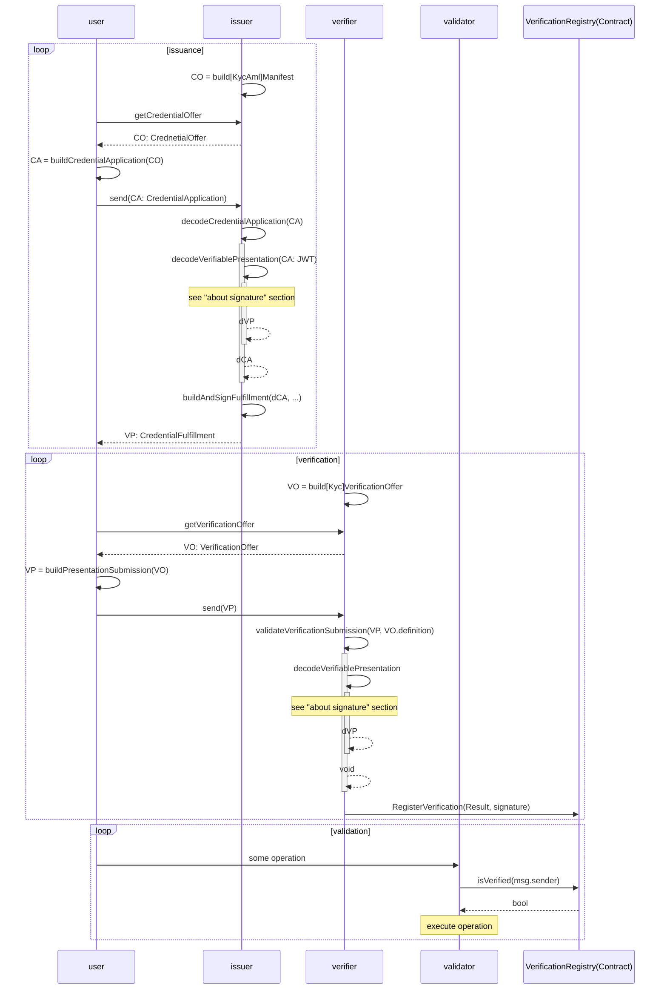
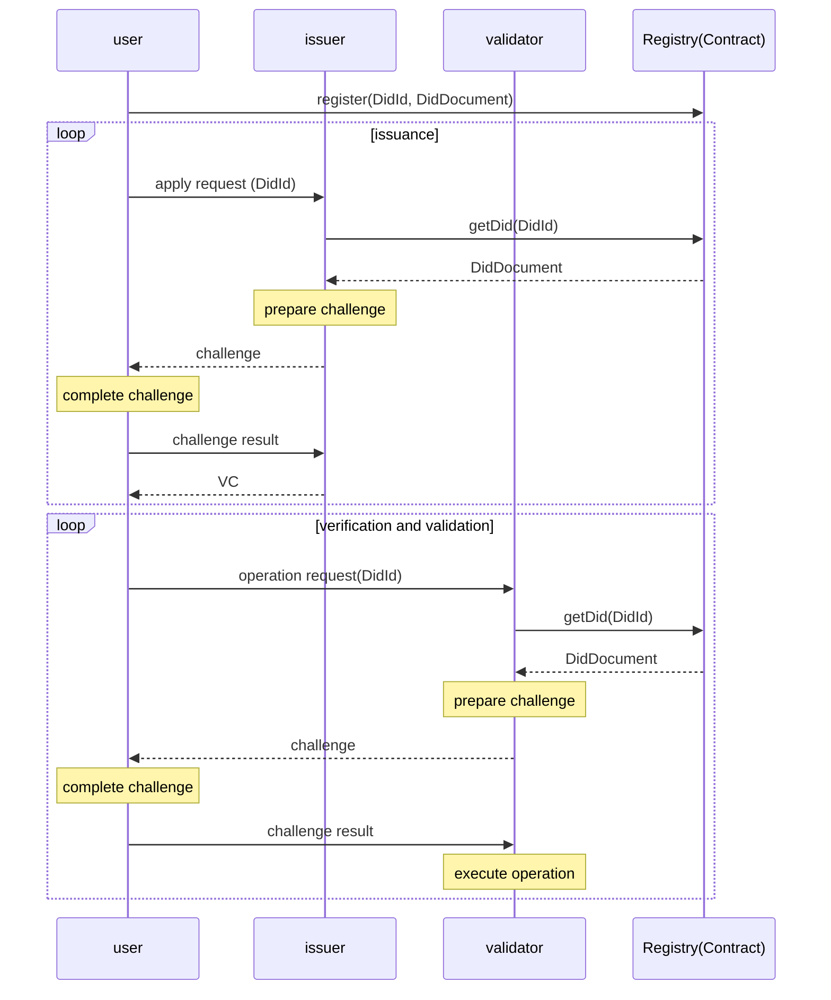
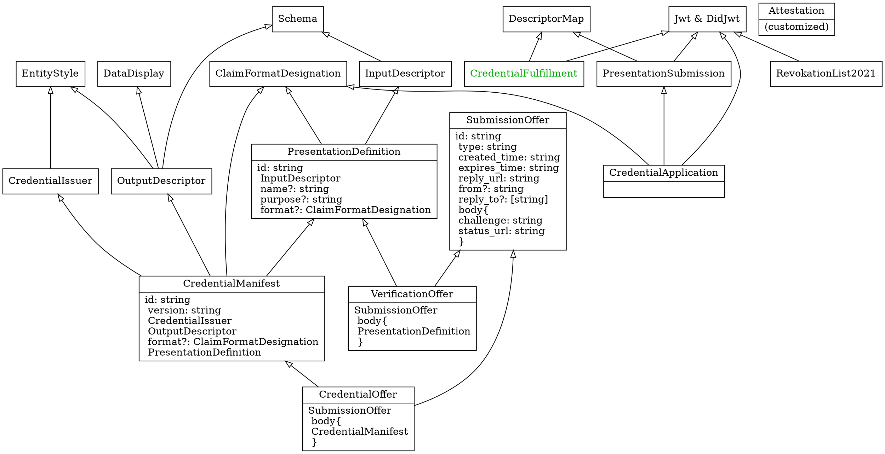
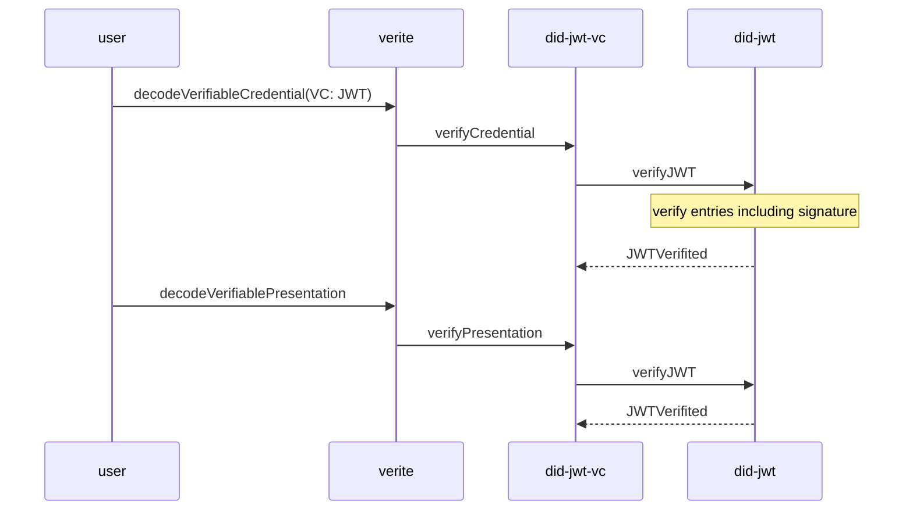

# Verite
[toc]
###### tags: `taisys`
## Flow
This section demonstrates the flow of verite comparing to the flow of baidu's implementation.



## Types

This part contains the `verite` SDK.

* did-jwt-vc
```ts
export interface Proof {
type?: string
[x: string]: any
}
export type Verifiable<T> = Readonly<T> & { readonly proof: Proof }
export type JWT = string
export type VerifiableCredential = JWT | Verifiable<W3CCredential>
export type VerifiablePresentation = JWT | Verifiable<W3CPresentation>
```
```ts
// VC difinition 
export interface CredentialStatus {
  id: string
  type: string
}
export type IssuerType = Extensible<{ id: string }> | string
export type DateType = string | Date
interface FixedCredentialPayload {
  '@context': string | string[]
  id?: string
  type: string | string[]
  issuer: IssuerType
  issuanceDate: DateType
  expirationDate?: DateType
  credentialSubject: Extensible<{id?: string}>
  credentialStatus?: CredentialStatus
  evidence?: any
  termsOfUse?: any
}
interface NarrowCredentialDefinitions {
  '@context': string[]
  type: string[]
  issuer: Exclude<IssuerType, string>
  issuanceDate: string
  expirationDate?: string
}
export type W3CCredential = Extensible<Replace<FixedCredentialPayload, NarrowCredentialDefinitions>>
/*
W3CCredential = {
  '@context': string[]
  id?: string
  type: string[]
  issuer: { id: string }
  issuanceDate: string
  expirationDate?: string
  credentialSubject: Extensible<{id?: string}>
  credentialStatus?: CredentialStatus
  evidence?: any
  termsOfUse?: any
  ...(extensible)
}
*/
```
   
   
```ts
// VP difinition here
type Replace<T, U> = Omit<T, keyof U> & U
type Extensible<T> = T & { [x: string]: any }

export interface FixedPresentationPayload {
  '@context': string | string[]
  type: string | string[]
  id?: string
  verifiableCredential?: string[]
  holder: string
  verifier?: string | string[]
  issuanceDate?: string
  expirationDate?: string
}
interface NarrowPresentationDefinitions {
  '@context': string[]
  type: string[]
  verifier: string[]
  verifiableCredential?: string[]
}

export type W3CPresentation = Extensible<Replace<FixedPresentationPayload, NarrowPresentationDefinitions>>
/*
W3CPresentation = {
  '@context': string[]
  type: string[]
  id?: string
  verifiableCredential?: string[]
  holder: string
  verifier: string
  issuanceDate?: string
  expirationDate?: string
  ...(extensible)
}
*/
```
    
    

* e2e-demo
```
packages/e2e-demo/
├── manifest
│   ├── creditScore.ts // VC type
│   ├── index.ts       // index of VC types
│   ├── issuer.ts      // issuer for all VCs
│   └── kyc.ts         // VC type

```
## Reading
Verite uses [did-jwt-vc](https://github.com/decentralized-identity/did-jwt-vc) repo as its foundation. While the repo is based on the [document](https://www.w3.org/TR/vc-data-model/#dfn-verifiable-presentations), the notes regarding the document is taken in the following.
* VC/VP: "Holders of verifiable credentials can generate verifiable presentations and then share these verifiable presentations with verifiers to prove they possess verifiable credentials with certain characteristics."
* Roles:
    * holder: `VC` possessor. Generate `VP` from one or more `VC(s)`
    * issuer: `VP` creator. Create `VC` from `claim`.
    * subject: An entity `claims` are made about.
    * verifier: verifies `VP`
    * registry
* misc.
    * `VC` **could** support parital disclosure.
    * `VP` can disclose `VC` or use a `derived predicate`, such as zero-knowledge proof.
    * Bidirectional verification of `VP` and `VC`

## About Signatures
To find a way to verify user

Encoded messages, `JWT`, is composed of three parts `[header].[payload].[signature]` separated by `.` (see [website](https://jwt.io)).

```
eyJhbGciOiJFZERTQSIsInR5cCI6IkpXVCJ9.eyJ2cCI6eyJAY29udGV4dCI6WyJodHRwczovL3d3dy53My5vcmcvMjAxOC9jcmVkZW50aWFscy92MSJdLCJ0eXBlIjpbIlZlcmlmaWFibGVQcmVzZW50YXRpb24iLCJDcmVkZW50aWFsQXBwbGljYXRpb24iXSwidmVyaWZpYWJsZUNyZWRlbnRpYWwiOltdLCJpZGVudGl0eSI6IkExMjM0NTY3ODEiLCJjcmVkZW50aWFsX2FwcGxpY2F0aW9uIjp7ImlkIjoiOGRjNzdjNGQtMTFkYy00OTJlLTllZTYtMzcyNjMyMWI1ZDVhIiwibWFuaWZlc3RfaWQiOiJJZEF0dGVzdGF0aW9uIiwiZm9ybWF0Ijp7Imp3dF92cCI6eyJhbGciOlsiRWREU0EiXX19LCJwcmVzZW50YXRpb25fc3VibWlzc2lvbiI6eyJpZCI6IjRiYmI3ODU3LTE2MGItNDQ4YS1hYmNjLTcwY2YwNmMyNGI1MiIsImRlZmluaXRpb25faWQiOiJQcm9vZk9mQ29udHJvbFByZXNlbnRhdGlvbkRlZmluaXRpb24iLCJkZXNjcmlwdG9yX21hcCI6W3siaWQiOiJwcm9vZk9mSWRlbnRpZmllckNvbnRyb2xWUCIsImZvcm1hdCI6Imp3dF92cCIsInBhdGgiOiIkIn0seyJpZCI6InByb29mT2ZJZGVudGlmaWVyQ29udHJvbFBlcnNvbmFsSWRlbnRpdHkiLCJmb3JtYXQiOiJqd3RfdnAiLCJwYXRoIjoiJCJ9XX19fSwiaXNzIjoiZGlkOmtleTp6Nk1rZXhNYWFEd21MNVZEanhRVExjZGs2WlhDY0ZkQzdUZjVCdEt2cm5pYktZZEsifQ.MT_PRHJm0zoo_7F-jcBHdu5J0C5CiS8vx8PbOJPHB2Efh5PMKKOW-vaCQwetZuwm3agb1Al5Fa-K4rOZX2ruDQ
```
The header and payload parts are simply encoded messages, whereas signature part is generated using the function below (verite's signing_algo is EdDSA)
```
signing_algo(
  base64UrlEncode(header) + "." +
  base64UrlEncode(payload),
  privateKey
)
```

## Demo
* Script
according to `verite/packages/verite/test/lib/validators/validate-verification-submission.test.ts`
* Compilation
After compile, local `*.mjs` files can import edited verite SDK and executed with `node [filename].mjs`
```bash
# git clone --depth=1 git@github.com:centrehq/verite.git
cd verite/packages/verite
npm run build
```
* notes
  * `offer.presentation_definition.input_descriptors[]` describe needs
  * each `input_descriptor` above, say `d`, has `d.constraints.fields.path` to find and verify from submissions 
  * `submission.presentation_submission.descriptor_map` is the root path for the above fields to check.
## reference
* `credential presentation`: [W3C credential](https://www.w3.org/TR/vc-data-model/#dfn-verifiable-presentations), [DIF presentation exchange](https://identity.foundation/presentation-exchange/#presentation-request)
* underlying types: [did-jwt-vc](https://github.com/decentralized-identity/did-jwt-vc/blob/master/src/types.ts), [did-jwt](https://github.com/decentralized-identity/did-jwt)
* [ideal flow](https://identity.foundation/wallet-and-credential-interactions/#swimlane-3)
* [VC proof](https://w3c-ccg.github.io/vc-extension-registry/)

# Demo

This section is mainly about the demo flow. It's mainly related to `packages/e2e-demo`, and `packages/wallet`.
## Run

```bash
npm run dev & # interface of issuer/verifier/validator
npm run hardhat:node & # start-up local blockchain for testing
npm run hardhat:deploy # deploy registry for verified VPs
npm run wallet # interface of users 
```
## Basic issuance
* About manifest fetching
  * qrCode is rendered through `pages/demos/issuer/kyc.tsx`
  * from the qrCode, manifest is fetched through `pages/api/demos/issuer/manifests/[type]/[token].ts`.
  * As the qrCode is defined in `lib/manifest/index.t`


# TODO

* async getVP
* react-native SDK transplant to IOS/Android
